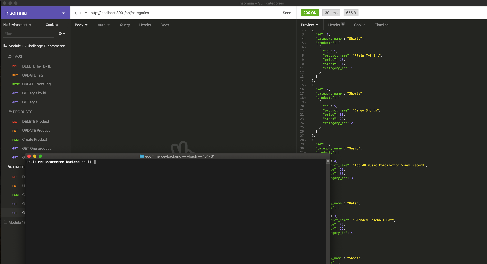

# E-Commerce Back End

## Description
The back end for an e-commerce site with starter code.
## Table of Contents
* [Installation](#installation)
* [Usage](#usage)
* [Video](#video)
* [License](#license)
* [Credits](#credits)
* [Tests](#tests)
* [Questions](#questions)
## Installation
clone repo and install npm mysql, sequelize, dotoenv, and express.
## Usage
None at the moment.
### Image:

## Video
Below is a link to a walkthrough video demonstrating the functionality of the e-commerce backend api routes and models.
* [Video](https://drive.google.com/file/d/1QniYFfCg7jBXKJZsOLO01U4OfZvXXnqx/view)
## License
Licensed under MIT.
## Credits
* W3Schools www.w3schools.com/  
* Stack OverFlow www.stackoverflow.com/
## Tests
N/A
## Questions
Please feel free to contact me. GitHub & LinkedIn links provided below along with my Email.
* [GitHub](github.com/saul10huerta)
* [Email](saul10huerta@utexas.edu)
* [LinkedIn](https://www.linkedin.com/in/saul10huerta/)